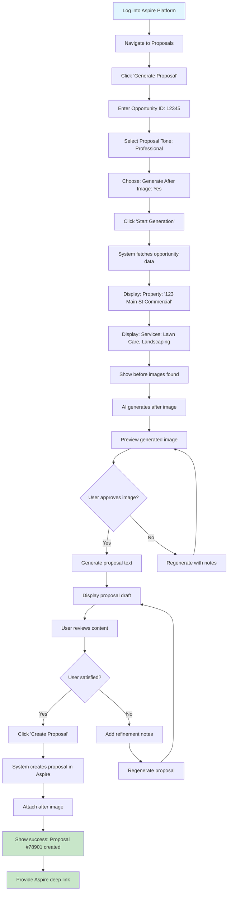
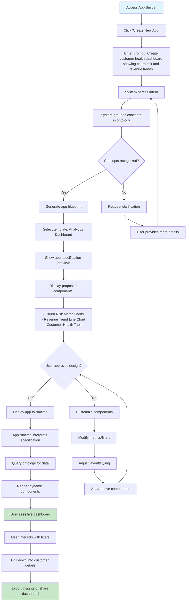
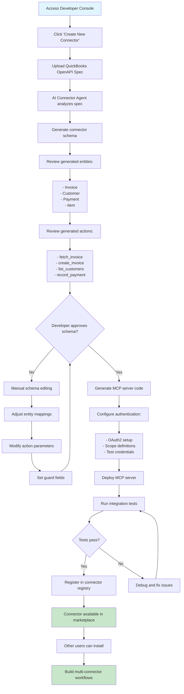

# Aspire Platform User Flow Guide

## Overview

This document outlines how different types of users will interact with the Aspire Platform once fully implemented. The platform serves multiple user personas through both workflow automation and app generation capabilities.

---

## User Personas

### **1. Field Service Manager** 
- **Role**: Operations management
- **Goals**: Automate proposal generation, monitor team performance
- **Tech Level**: Business user, limited technical skills

### **2. Business Analyst**
- **Role**: Data analysis and reporting  
- **Goals**: Create custom dashboards, analyze trends
- **Tech Level**: Power user, comfortable with data tools

### **3. Platform Developer**
- **Role**: Build and maintain connectors
- **Goals**: Extend platform capabilities
- **Tech Level**: Technical, development skills

### **4. Workspace Administrator**
- **Role**: Platform configuration and user management
- **Goals**: Setup integrations, manage access
- **Tech Level**: Technical admin, some development knowledge

---

## User Journey Flows

## Flow 1: Field Service Manager - Proposal Generation

### **Scenario**: Generate a proposal for a new landscaping opportunity



### **Step-by-Step Experience:**

#### **1. Initial Setup** (One-time)
- Admin configures Aspire credentials
- User gains access to proposal generation app

#### **2. Proposal Generation Session**
```
1. User Input Phase
   ├── Select opportunity from Aspire
   ├── Choose proposal tone (Professional/Friendly/Concise)  
   └── Toggle after-image generation

2. Data Gathering Phase
   ├── System fetches opportunity details
   ├── Displays property information
   ├── Shows service list and revenue
   └── Finds before images (if any)

3. Image Generation Phase (Optional)
   ├── AI generates after image
   ├── User previews result
   ├── Option to regenerate with style hints
   └── User approves or skips

4. Proposal Creation Phase
   ├── AI generates proposal text
   ├── User reviews content in editor
   ├── Option to refine with notes
   ├── Regenerate as needed
   └── User approves final version

5. Completion Phase
   ├── System creates proposal in Aspire
   ├── Attaches after image (if generated)
   ├── Returns proposal ID and deep link
   └── User can view in Aspire or share
```

---

## Flow 2: Business Analyst - Custom Dashboard Creation

### **Scenario**: Create a customer health monitoring dashboard



### **App Builder Experience:**

#### **1. Prompt-to-App Pipeline**
```
Natural Language Input:
"Create a customer health console showing churn risk, revenue trends, and support sentiment"

↓ Intent Parsing
- Intent: operational_console
- Entity: customer
- Metrics: [churn_risk, revenue_trend]  
- Signals: [support_sentiment]

↓ Ontology Grounding
- churn_risk → Customer churn prediction model
- revenue_trend → Aggregated revenue metric by date
- support_sentiment → NLP analysis of support tickets

↓ Template Selection
- Template: operational_console
- Components: metric_card, line_chart, sentiment_panel
- Layout: dashboard grid

↓ App Specification Generation
{
  "app_id": "customer_health_console",
  "template": "operational_console",
  "entities": ["customer"],
  "components": [
    {"type": "metric_card", "metric": "churn_risk"},
    {"type": "line_chart", "metric": "revenue_trend", "dimension": "date"},
    {"type": "sentiment_panel", "signal": "support_sentiment"}
  ]
}

↓ Runtime Deployment
- Specification interpreted by runtime
- Components rendered dynamically
- Data queries resolved through ontology
- Live dashboard available to user
```

#### **2. Customization Options**
- **Metrics**: Add/remove business metrics
- **Filters**: Apply workspace-level filters
- **Layout**: Adjust component sizing and placement
- **Styling**: Apply company branding
- **Sharing**: Configure access permissions

---

## Flow 3: Platform Developer - Connector Creation

### **Scenario**: Add QuickBooks integration for invoice workflows



### **Developer Workflow:**

#### **1. Connector Development Lifecycle**
```
1. Specification Phase
   ├── Obtain target system OpenAPI spec
   ├── Run connector-agent for analysis
   ├── Review generated connector schema
   └── Human validation and adjustment

2. Implementation Phase
   ├── Generate MCP server scaffold
   ├── Configure authentication strategy
   ├── Implement custom business logic
   └── Add error handling and retries

3. Testing Phase
   ├── Unit tests for each MCP tool
   ├── Integration tests with target system
   ├── Error scenario validation
   └── Performance benchmarking

4. Deployment Phase
   ├── Container packaging
   ├── Registry publication
   ├── Documentation generation
   └── Marketplace listing

5. Maintenance Phase
   ├── Version management
   ├── Breaking change handling
   ├── Security updates
   └── Feature enhancements
```

---

## Flow 4: Workspace Administrator - Platform Setup

### **Scenario**: Configure new workspace with multiple integrations

```mermaid
graph TD
    A[Create Workspace Account] --> B[Access Admin Dashboard]
    B --> C[Configure Integrations]
    
    C --> D[Add Aspire Credentials]
    D --> E[OAuth2 setup with Aspire]
    E --> F[Test connection successful]
    
    F --> G[Add QuickBooks Credentials]
    G --> H[OAuth2 setup with QuickBooks] 
    H --> I[Test connection successful]
    
    I --> J[Configure User Access]
    J --> K[Invite team members]
    K --> L[Assign role permissions:]
    L --> M[- Manager: All apps<br/>- Analyst: Dashboard apps<br/>- User: Proposal app only]
    
    M --> N[Install Pre-built Apps]
    N --> O[Browse marketplace]
    O --> P[Install: Proposal Generator]
    P --> Q[Install: Invoice Automation]
    Q --> R[Install: Customer Analytics]
    
    R --> S[Configure App Settings]
    S --> T[Set proposal tone defaults]
    T --> U[Configure approval workflows]
    U --> V[Set up notification rules]
    
    V --> W[Platform Ready for Team]
    W --> X[Users can access apps]
    X --> Y[Monitor usage analytics]
    Y --> Z[Scale and optimize as needed]
    
    style A fill:#e1f5fe
    style W fill:#c8e6c9
    style Z fill:#c8e6c9
```



### **Admin Configuration Experience:**

#### **1. Initial Workspace Setup**
```
Workspace Creation
├── Company information and settings
├── Billing and subscription management  
├── Basic security and compliance config
└── Initial admin user setup

Integration Configuration  
├── Connector credential management
│   ├── OAuth2 flow completion
│   ├── API key secure storage
│   ├── Connection testing and validation
│   └── Credential rotation scheduling
├── Multi-tenant data isolation setup
├── Rate limiting and quota configuration
└── Audit logging and monitoring setup

User Management
├── Team member invitation workflow
├── Role-based access control (RBAC)
├── Single sign-on (SSO) integration
└── User onboarding and training resources
```

#### **2. App Marketplace Management**
```
App Discovery
├── Browse by category (Analytics, Automation, etc.)
├── Filter by connector compatibility
├── View ratings and usage statistics  
└── Read documentation and requirements

App Installation
├── One-click installation process
├── Automatic dependency resolution
├── Configuration wizard for app settings
└── Testing and validation before go-live

App Configuration
├── Workspace-specific customization
├── Default settings and templates
├── Approval workflow setup
└── Integration with existing business processes
```

---

## Cross-Flow Integration Scenarios

### **Multi-User Collaboration Flow**

#### **Scenario**: Manager creates proposal, analyst builds performance dashboard

```
1. Manager generates proposals (Flow 1)
   ├── Creates multiple proposals over time
   ├── Proposals stored in Aspire with metadata
   ├── Success/failure patterns emerge
   └── Performance data accumulates

2. Analyst identifies need for insights (Flow 2)  
   ├── Wants to track proposal win rates
   ├── Needs to optimize proposal timing
   ├── Requires revenue forecasting
   └── Seeks team performance metrics

3. Analyst builds analytics dashboard
   ├── Prompts: "Show proposal win rates by rep and service type"
   ├── System pulls data from Aspire + platform logs
   ├── Creates operational console with:
   │   ├── Win rate metrics by team member
   │   ├── Revenue trends by service category  
   │   ├── Proposal cycle time analytics
   │   └── AI image usage correlation analysis

4. Manager uses insights for optimization
   ├── Identifies top-performing proposal styles
   ├── Optimizes team training based on data
   ├── Adjusts pricing strategies
   └── Improves proposal timing decisions
```

### **Platform Evolution Flow**

#### **From Simple Workflow to Intelligent Ecosystem**

```
Week 1-4: Foundation
├── Basic proposal generation working
├── Single user, simple workflows
├── Manual refinement and approval
└── Direct Aspire integration

Month 2-3: Enhanced Workflows  
├── Multiple team members using proposals
├── Custom templates and tones
├── Image generation optimization
└── Basic error handling and retry logic

Month 4-6: Analytics Introduction
├── First custom dashboards created
├── Performance metrics visibility
├── Process optimization insights  
└── Multi-connector workflows (QuickBooks)

Month 7-12: Intelligent Operations
├── AI-driven insights and recommendations
├── Automated workflow triggers
├── Predictive analytics capabilities
└── Full marketplace ecosystem

Year 2+: Advanced Intelligence
├── Cross-platform data correlation
├── Industry-specific app templates
├── Advanced AI agents for process automation
└── Enterprise-wide operational intelligence
```

---

## Technical User Experience Details

### **Performance Characteristics**

#### **User Experience Expectations:**
```
App Generation: <5 seconds from prompt to deployed app
Proposal Generation: <30 seconds end-to-end  
Dashboard Loading: <2 seconds for data visualization
Real-time Updates: <500ms for filter/interaction responses
Connector Response: <200ms for typical MCP tool calls
```

#### **Error Handling Experience:**
```
Graceful Degradation
├── Image generation fails → Continue without image
├── Connector timeout → Retry with user notification
├── Invalid prompt → Guided refinement suggestions
└── Data unavailable → Clear messaging and alternatives

User Feedback
├── Loading states for all long operations
├── Progress indicators for multi-step processes  
├── Clear error messages with resolution steps
└── Contextual help and documentation links
```

### **Mobile and Responsive Experience**

#### **Mobile-First Scenarios:**
- **Field Manager**: Approve proposals on mobile while on-site
- **Executive**: View dashboard metrics during travel
- **Analyst**: Monitor alerts and notifications
- **Sales Rep**: Generate quick proposals from customer meetings

---

## Conclusion

The Aspire Platform provides a seamless user experience that scales from simple workflow automation to sophisticated AI-powered application generation. The platform grows with users' needs, starting with immediate workflow value and evolving into a comprehensive operational intelligence system.

**Key Success Factors:**
- **Intuitive Onboarding**: Users can start generating value within minutes
- **Progressive Complexity**: Advanced features available when needed
- **Collaborative Workflows**: Multiple personas work together effectively  
- **Extensible Architecture**: Platform capabilities expand with business needs